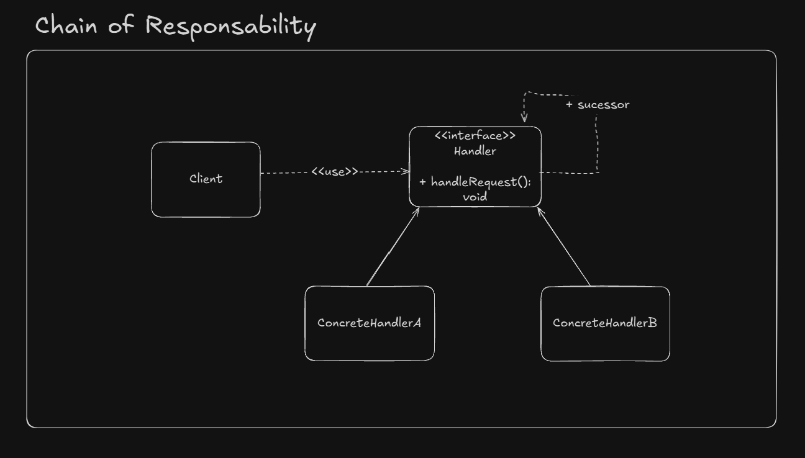

# Chain of Responsibility

The Chain of Responsibility is a behavioral design pattern that allows you to decouple the sender of a request from its receivers by passing the request along a chain of potential handlers. Each handler in the chain decides either to process the request or to pass it to the next handler.

## Key Concepts

- **Decoupling**: The sender of the request does not need to know which handler will process it.
- **Chain Structure**: Each handler holds a reference to the next handler in the chain.
- **Flexibility**: You can dynamically add or remove handlers or change their order.

## UML Example



## Implementation Considerations

- **Handler Interface**: Define a common interface or abstract class for all handlers.
- **Concrete Handlers**: Implement specific logic in concrete handler classes.
- **Chain Termination**: Ensure the chain has a termination condition to avoid infinite loops.
- **Real-World Example**: Servlet filters in Java follow this pattern.

## Advantages

- Promotes loose coupling between sender and receiver.
- Simplifies object responsibilities by dividing them among multiple handlers.
- Makes the system more flexible and easier to extend.

## Disadvantages

- Can make debugging more difficult due to the dynamic nature of the chain.
- If not managed properly, the chain can become too long or complex.

## Example in Java

```java
public interface Handler {
    void setNextHandler(Handler nextHandler);
    void handleRequest(String request);
}

public class ConcreteHandlerA implements Handler {
    private Handler nextHandler;

    @Override
    public void setNextHandler(Handler nextHandler) {
        this.nextHandler = nextHandler;
    }

    @Override
    public void handleRequest(String request) {
        if (request.equals("A")) {
            System.out.println("Handler A processed the request.");
        } else if (nextHandler != null) {
            nextHandler.handleRequest(request);
        }
    }
}

public class ConcreteHandlerB implements Handler {
    private Handler nextHandler;

    @Override
    public void setNextHandler(Handler nextHandler) {
        this.nextHandler = nextHandler;
    }

    @Override
    public void handleRequest(String request) {
        if (request.equals("B")) {
            System.out.println("Handler B processed the request.");
        } else if (nextHandler != null) {
            nextHandler.handleRequest(request);
        }
    }
}

public class Client {
    public static void main(String[] args) {
        Handler handlerA = new ConcreteHandlerA();
        Handler handlerB = new ConcreteHandlerB();

        handlerA.setNextHandler(handlerB);

        handlerA.handleRequest("A");
        handlerA.handleRequest("B");
        handlerA.handleRequest("C");
    }
}
```

In this example, `ConcreteHandlerA` and `ConcreteHandlerB` process specific requests, while unhandled requests are passed along the chain.Chain of Responsability

A way to decouple processing handle logic delegating it to multiple objects

Each handler have a reference to the next handler, util the chain finishes