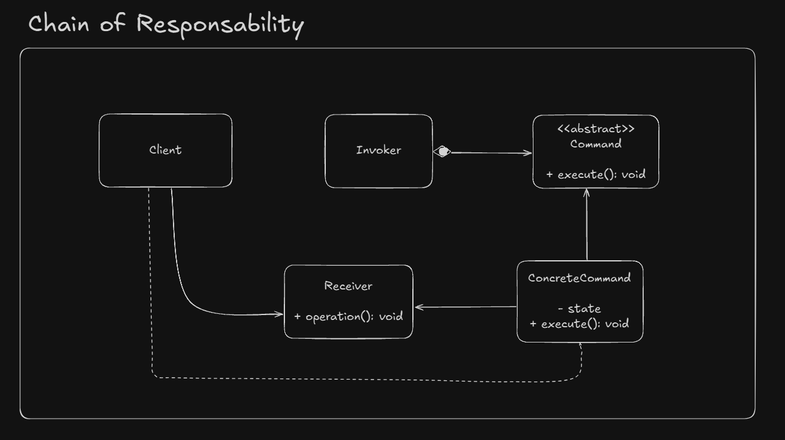

# Command Design Pattern

The **Command** design pattern is a behavioral pattern that encapsulates a request as an object, thereby allowing for parameterization of clients with different requests, queuing of requests, and logging of the requests. It also provides support for undoable operations.


## Intent

- Encapsulate a request as an object.
- Decouple the sender and receiver of the request.
- Allow for operations like queuing, logging, and undoing commands.


## Structure

1. **Command**: Declares an interface for executing an operation.
2. **ConcreteCommand**: Implements the Command interface and defines the binding between a Receiver object and an action.
3. **Receiver**: Knows how to perform the operations associated with carrying out a request.
4. **Invoker**: Asks the command to carry out the request.
5. **Client**: Creates specific command objects and sets their receivers.


## Participants

- **Command**: Defines the interface for all commands.
- **ConcreteCommand**: Implements the execute method by invoking the corresponding operations on the Receiver.
- **Receiver**: Performs the actual work when the command is executed.
- **Invoker**: Stores and invokes commands.
- **Client**: Configures the commands and their receivers.


## UML Example



## Example

```java
// Command interface
public interface Command {
    void execute();
}

// Receiver
public class Light {
    public void turnOn() {
        System.out.println("Light is ON");
    }

    public void turnOff() {
        System.out.println("Light is OFF");
    }
}

// ConcreteCommand
public class TurnOnLightCommand implements Command {
    private Light light;

    public TurnOnLightCommand(Light light) {
        this.light = light;
    }

    @Override
    public void execute() {
        light.turnOn();
    }
}

// Invoker
public class RemoteControl {
    private Command command;

    public void setCommand(Command command) {
        this.command = command;
    }

    public void pressButton() {
        command.execute();
    }
}

// Client
public class Main {
    public static void main(String[] args) {
        Light light = new Light();
        Command turnOn = new TurnOnLightCommand(light);

        RemoteControl remote = new RemoteControl();
        remote.setCommand(turnOn);
        remote.pressButton();
    }
}
```


## Applicability

Use the Command pattern when:

- You need to parameterize objects with operations.
- You want to support undoable operations.
- You need to log or queue requests.


## Pros and Cons

### Pros
- Decouples the sender and receiver.
- Supports undo/redo functionality.
- Makes it easier to add new commands.

### Cons
- Can result in a large number of command classes.


## Related Patterns

- **Memento**: Often used to implement undo functionality.
- **Strategy**: Encapsulates algorithms, while Command encapsulates requests.
