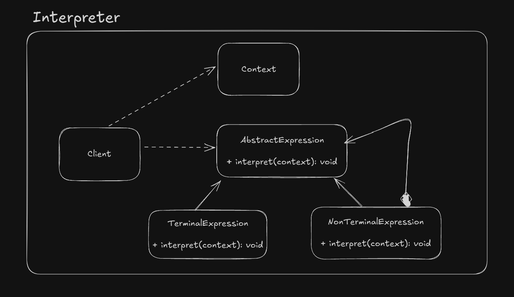

# Interpreter

Allows us to represent the rules of language or grammar in a data structure and then interpret sentences in that language.

Each class in this pattern represents a rule in the language. Classes also provide a method to interpret an expression.

`java.util.regex.Pattern` is an example of the Interpreter design pattern.

## UML Example

## Implementation considerations

- The parsing have to be done by our own
- Context object can be used to store and access state of the interpreter

## Design considerations

- Visitor pattern can be used to interpret
- Fliweight can be used for terminal expressions