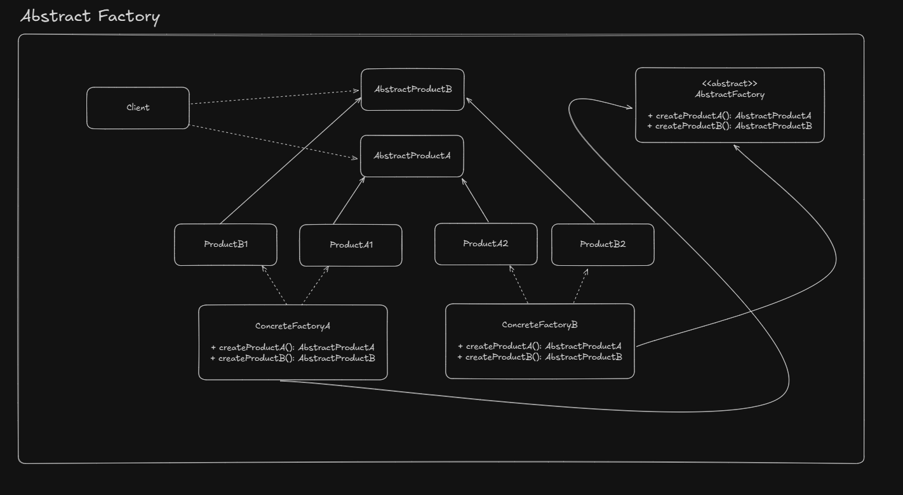

# Abstract Factory

Basically used to produce sets or families of related objects without specifying their concrete class

## UML Example

## Implementation considerations

- Factories can be singletons, because we tically need only one instance of it anyway
- Adding a new product requires changes on base factory
- We provide concrete factories to the client code (the goal is allow it to create objects)

## Design considerations

- Good to constraint object creation
- Abstract factory uses factory methods
- If the objects are expensive to create, we can combine prototype or singleton design patterns inside the factories