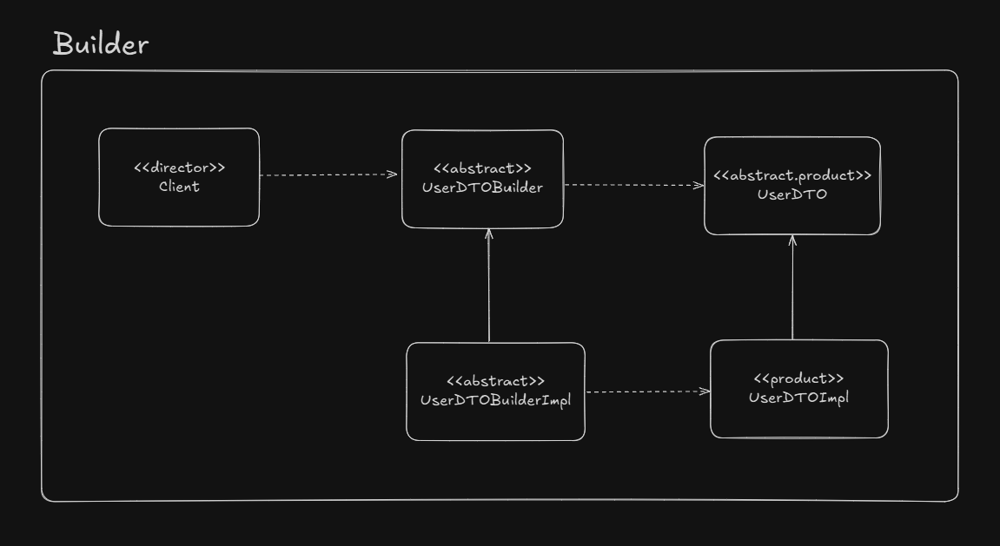

# Builder

The main purpose of builder pattern is to reduce the usage of useless constructors and to create immutable objects. Look at the example above: imagine the `User` class is immutable.

```java
public class User {

    private Long id;
    private String username;
    private String password;

    public User(id, usernmame, password) {
        this.id = id;
        this.username = username;
        this.password = password;
    }

}
```

We have to pass a lot of information, in a specific order, to populate the `User` class correctly

## What is a builder?

- We have a complex process to construct an object involving multiple steps, then builder design pattern can help us.

- In builder we remove the logic related to object construction from "client" code & abstract it in separate classes

## UML Example

