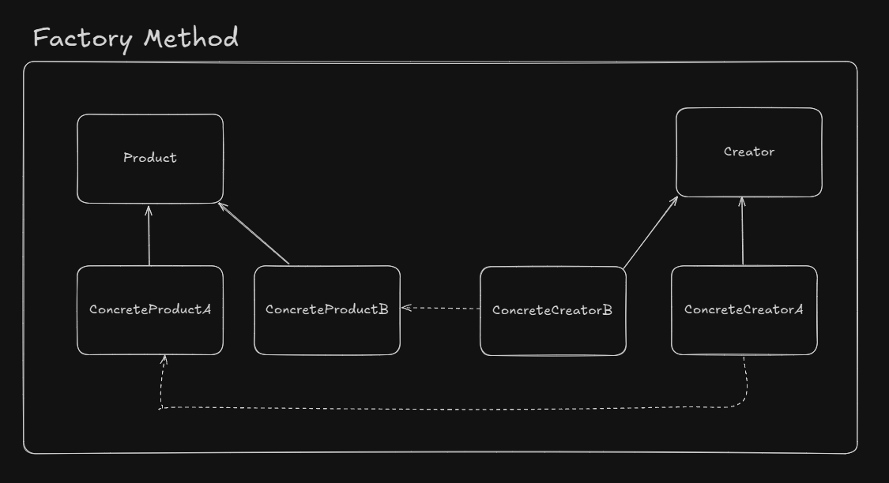

# Factory Method

With factory methods, we want to move out the object creation logic from our code to a separate class (but slightly different of the simple factory approach).

We use this pattern when we do not kwnow in advance wich class we may need to create and this enables us to add new classes without affecting the client code.

The object creation will be delegated to subclasses.

## UML Example

## Design considerations

- We tipically end up with a concrete creator per object type

- There other design patterns that uses factory methods, such as *template method* and *abstract factory*