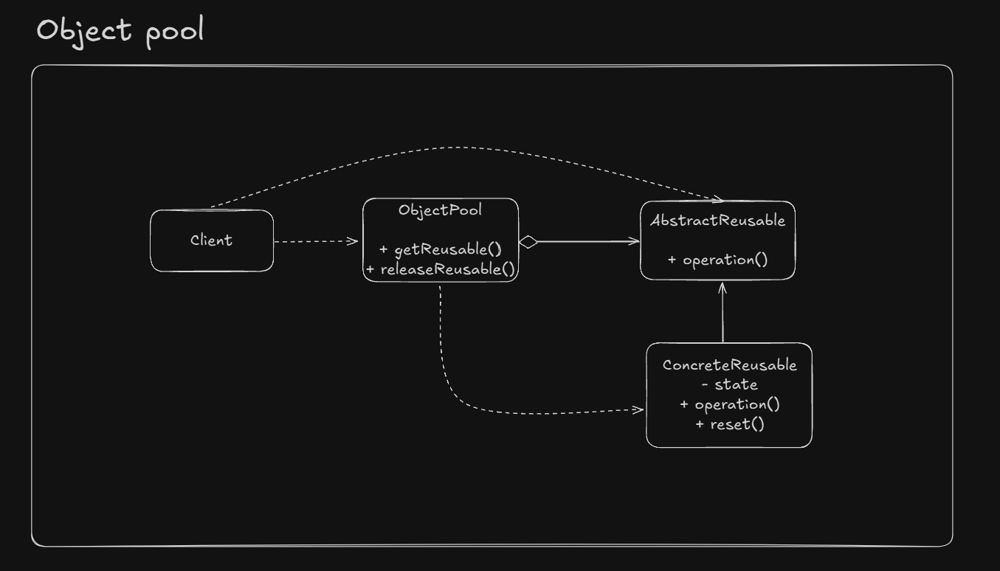

# Object Pool

If the cost for creating an instance of a class is high and we need a lot of 
those instances in a short period of time, object pool can solve this.

Objects will be pre-created and unused instances will be stored in a memory cache.

*Before use this, be sure about what you're doing because it can ruin the application performance. This is one of the most complicated patterns to implement efficiently.*

## UML Example

## Implementation considerations

- Reset operation should be lighweight
- Increases performance in runtime, but can add some extra start up time and memory consumption
- Should consider reset time needed and try to do it outside synchronized context

## Design considerations

- Parameters can be added for criteria puporses for selecting objects and also can be used to return multiple objects
- Should be used only if the object's initialization cost is high and depends of an external resource such as threads or connections
- Long lived objects should not be pooled. It could ruin out the application performance
