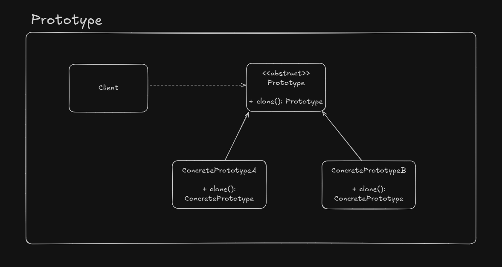

# Prototype

Handles the creation of a complex object by using an existing instance of another with same class definition.

## UML

## Implementation considerations

- Sometimes we need to do deep copies if the object contains mutable fields
- Mutable states must be reseted before returning a prototype
- `clone()` method access modifier must be public to be callable from outside the class

## Design consideration

- Useful for large objects and for the Composite and Decorator patterns
- It's possible to create a prototype registry, so the client code can access and choose wich instance should be cloned