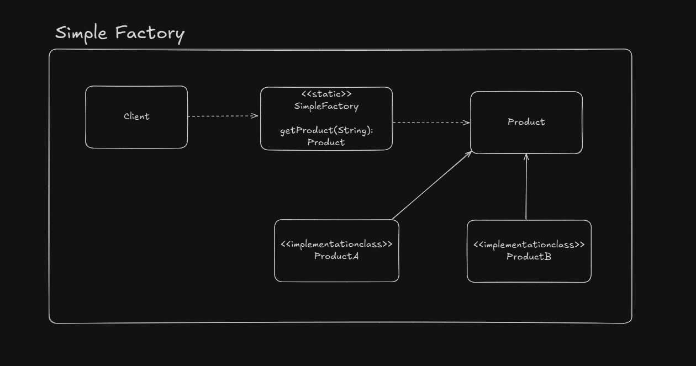

# Simple Factory

Basically handles conditional object instantiation scenarios.

*Note: this is often confused with factory methods*

## UML Example

## Design consideration

- A simple factory could be a existing method inside the product class
- It can be combined with other design patterns such as builder to instantiate objects

## Simple Factory x Factory Method

|Simple Factory | Factory Method                                                                                |
|---------------|-----------------------------------------------------------------------------------------------|
| Just moves away the instantiation logic from client code  | Delegates the instantiation logic to subclasses   |
| Knows all the classes to create                           | Don't knows all the classes that could be created |