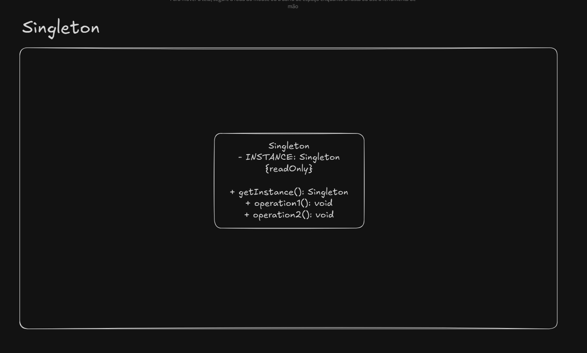

# Singleton

An unique instance accessible for the whole application via method or fields.

The main problem this pattern solves is to ensure that only one instance of a desired class exists.

All states contained in a singleton becomes global.

## UML Example

## Possible implementations

- Eager: created as soon as it loads
- Lazy: created when it is required

## Implementation considerations

- Do eager first. If you face some problems, try to switch to lazy approach

## Design considerations

- Singleton creation does not need any parameters
- Don't carry a lot of mutable global state
