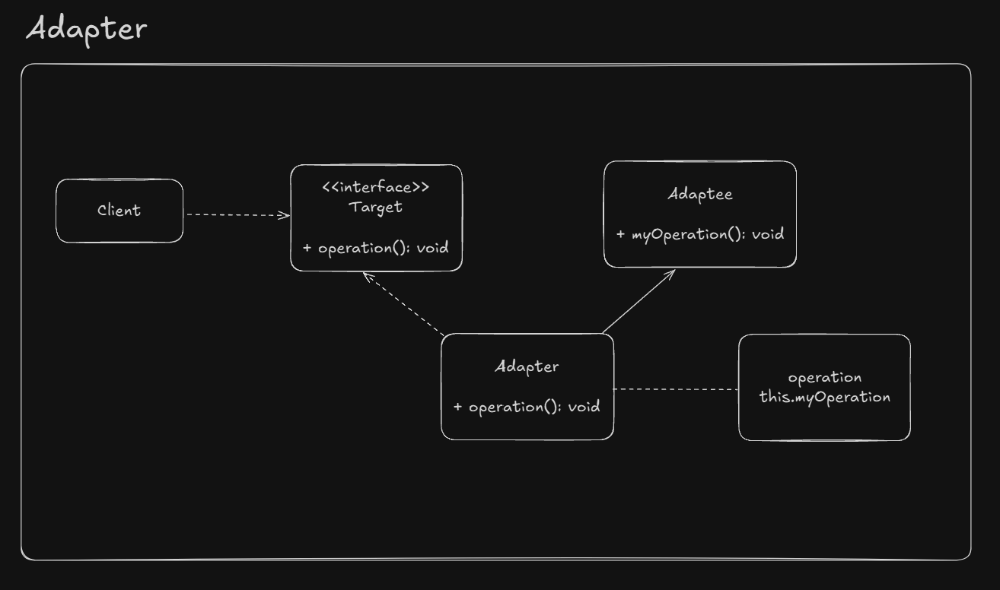
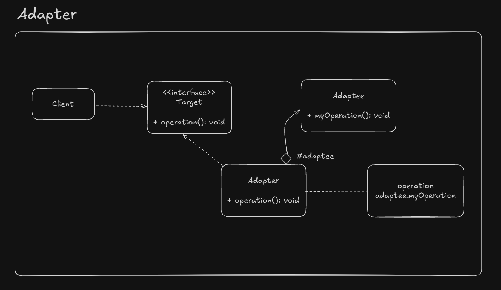

# Adapter

The client code needs to use a feature, but the object available doesn't provide this feature. So we have to adapt this object someway to provide this feature. 

And them, the adapter deign pattern comes to solve this problem. It's also called as "wrapper" since it "wraps" the existing object.

We can implement an adapter in two ways:

- Class adapter
- Object adapter

## UML Example - Class adapter

## UML Example - Object adapter

## Implementation considerations

- Implementation work will depend of the similarity between the source and target classes
- It allows to override adaptee's behavior. But this shouldn't be done

## Design considerations

- Prefer usde Object Adapter approach (composition over inheritance)

