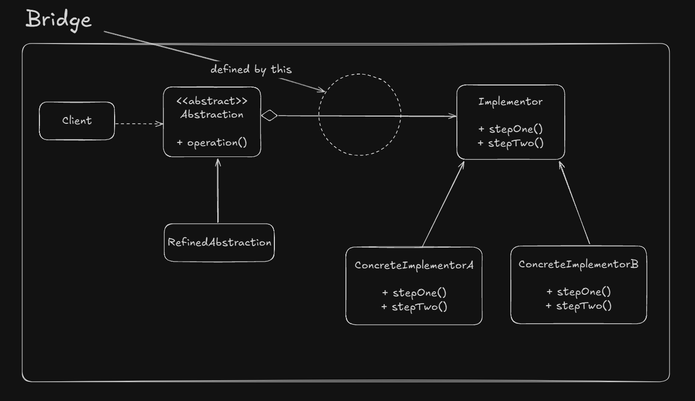

# Bridge

Normally implementations and abstractions are coulpled to each other in normal inheritance.

But Bridge proposes that its possible to decouple them. In other words, that its possible to change them without 
affecting each other (yeah sounds weird)

## UML Example

## Implementation considerations

- Abstract implementor could be avoided if we are handling with single implemenations

## Design considerations

- It's definitly possible to change abstraction and implementor independently
- With abstract factory it's possible to decouple concrete implementors from abstractions
