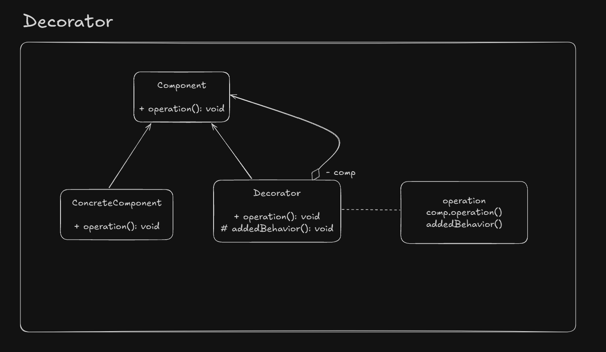

# Decorator

Used when we want to enhance some behavior of an existing object dinamically.

It wraps an object withing itself and provides same interface as the wrapped object. So the 
client of original object doesn't need to change.

Babsically an alternative to subsclasses for extending features.

## UML Example

## Implementation considerations

- Try to avoid large states. Decorators may not need all of them.
- With Collections, pay attention to `equals()` `and hashCode()` methods
- It supports recursive composition, but debugging can be challenging

## Design considerations

- Decorators are more flexible and powerful than inheritance
- They should be like a *skin* over your object, adding small behaviours and don't changing the meaning 
of the operations