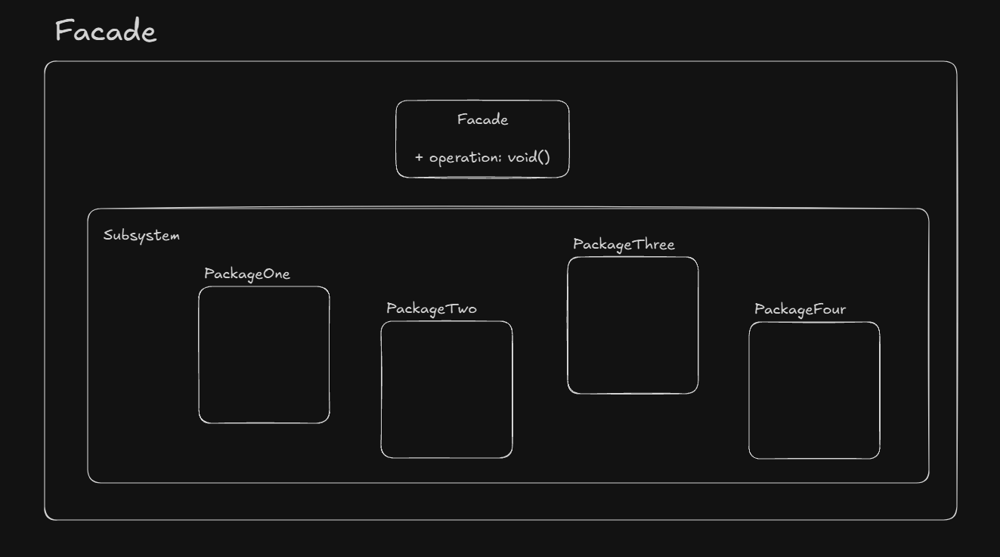

# Facade

Facade provides a simple and unified interface to a subsystem. Client interacts with just the facade 
now to get the same result.

## UML Example

## Implementation consideration

- Should minimize the complexity of subsystems and provide usable interface
- It's possible to have abstract classes or interfaces for facade and client can interact with different 
subsystem implementations

## Design considerations

- Great to simplify dependencies