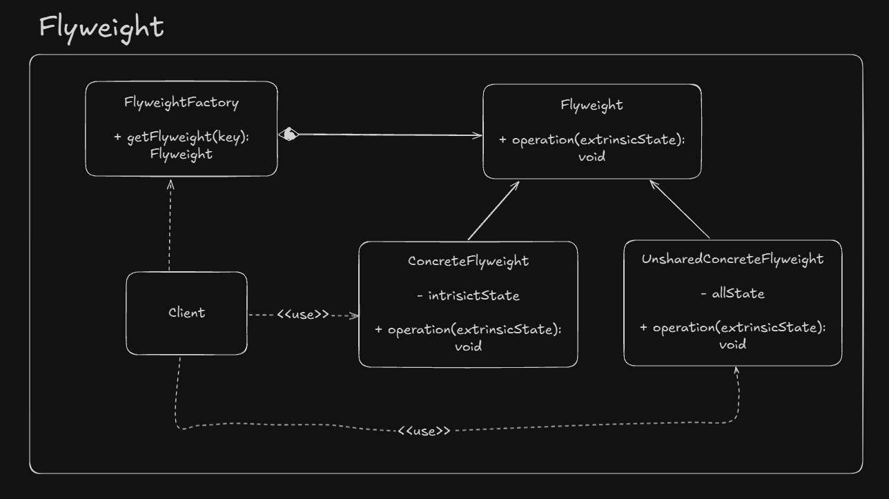

# Flyweight

Allows us to share an object in multiple contexts by dividing it state in two parts: *intrinsic (available in all contexts)* and 
*extrinsic (context specific state)*.

## UML Example

## Implementation considerations

- Factory is always necessary.
- Intrinsic state should be immutable.

## Design considerations

- The usability of this patter will depends of presence of sensible intrinsic state in object wich can be moved out 
without any issue.
- Other design patterns like state and strategy can make best use of flyweight pattern.