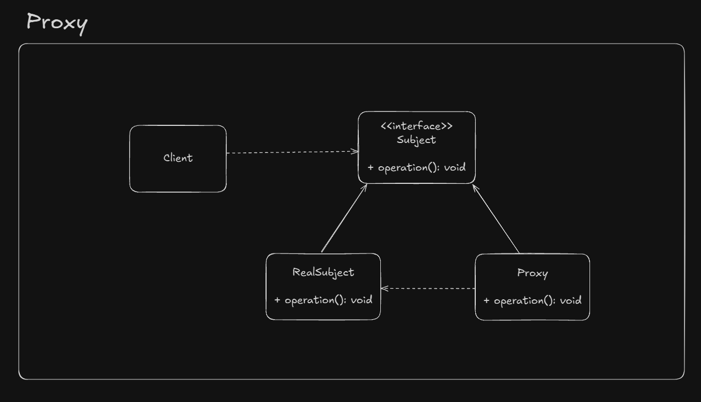

# Proxy

A placeholder to another object

Main motivations:

- Protection Proxy - Control access to original object's operations
- Remote Proxy - Provides a local representation of a remote object
- Virtual Proxy - Delays construction of original object until absolutely necessary

Client is unaware of existence of proxy. It works transparently

## UML Example

## Implementation considerations

- Proxy can cache some state on behalf of real object in creation on demand use cases
- Be aware of performance costs and possible syncronization issues

## Design considerations

- Proxy do not neet to know about concrete implementations of real object
- With Java it's possible to do dynamic proxy
- Great for security and for costly object creation